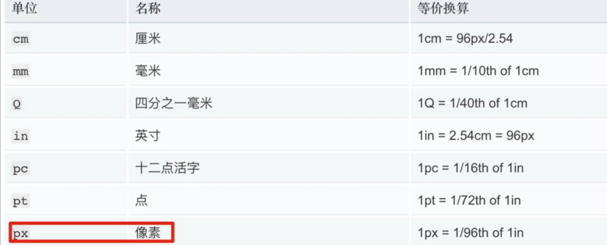
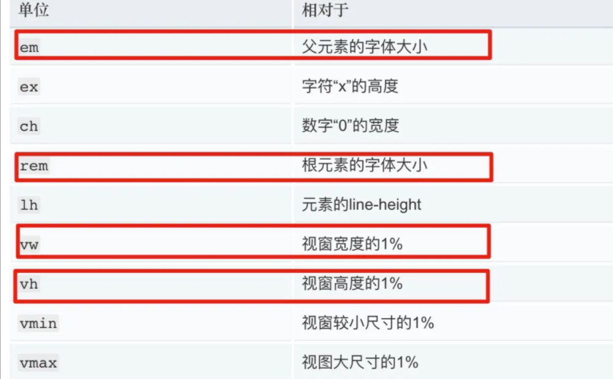

## 移动端H5问题总结

### 1、1px问题
- 在移动端 web 开发中，如果UI设计稿中设置边框为1像素，前端在开发过程中如果直接设置 border: 1px, 测试会发现 retina 屏机型中，1px会比较粗，即是较经典的 1px 像素问题。

#### 产生的原因
- 设备像素比：dpr=window.devicePixelRatio，也就是设备的物理像素与逻辑像素的比值。
- **DPR**
    - 设备像素比DPR(devicePixelRatio)是默认缩放为100%的情况下，设备像素和CSS像素的比值dpr，也被成为device pixel ratio，即物理像素与逻辑像素的比。
    - > DPR = 设备像素 / CSS像素(某一方向上)
- 在 retina 屏的手机上，dpr 为 2（iPhone8）或 3（iPhone8 Plus），css里写的 1px 宽度映射到物理像素上就有 2px 或 3px 宽度。
- 例如：iPhone6 的dpr为2，物理像素是 750（x轴），它的逻辑像素为 375。也是就是说，1个逻辑像素，在x轴 和 y轴 反向，需要 2个物理像素 来显示，即：dpr=2时，表示1个 css 像素由 4个物理像素点 组成。

#### 解决方案
1. 伪类+transform实现
原理：是把原先元素的 border 去掉，然后利用 :before 或者 :after 重做 border ，并 transform 的 scale 缩小一半，原先的元素相对定位，新做的 border 绝对定位。
- 单条border样式设置
```css
    .scale {
        position: relative;
        border:none;
    }
    .scale:after {
        content: '';
        position: absolute;
        bottom: 0;
        background: #000;
        width: 100%;
        height: 1px;
        -webkit-transform: scaleY(0.5);
        transform: scaleY(0.5);
        -webkit-transform-origin: 0 0;
        transform-origin: 0 0;
    }
```
- 四条boder样式设置
```css
    .scale {
        position: relative;
        margin-bottom: 20px;
        border:none;
    }
    .scale:after {
        content: '';
        position: absolute;
        top: 0;
        left: 0;
        border: 1px solid #000;
        -webkit-box-sizing: border-box;
        box-sizing: border-box;
        width: 200%;
        height: 200%;
        -webkit-transform: scale(0.5);
        transform: scale(0.5);
        -webkit-transform-origin: left top;
        transform-origin: left top;
    }
```
- 最好在使用前也判断一下，结合 JS 代码，判断是否 Retina 屏
```js
    if(window.devicePixelRatio && devicePixelRatio >= 2){
        document.querySelector('ul').className = 'scale';
    }
```

2. 使用box-shadow模拟边框
利用css 对阴影处理的方式实现0.5px的效果
```css
    .box-shadow-1px {
        box-shadow: inset 0px -1px 1px -1px #c8c7cc;
    }
```

3. 0.5px 方案
在IOS8+，苹果系列都已经支持0.5px了，可以借助媒体查询来处理。
```css
.border { border: 1px solid #999 };
@media screen and (-webkit-min-device-pixel-ratio: 2) {
    .border { border: 0.5px solid #999 };
}
/*ios dpr=2和dpr=3情况下border相差无几，下面代码可以省略*/
@media screen and (-webkit-min-device-pixel-ratio: 3) {
    .border { border: 0.333333px solid #999 };
}
```
IOS7及以下和Android等其他系统里，0.5px将会被显示为0px。那么我们就需要想出办法解决，说实在一点就是找到Hack。

解决方案是通过JavaScript检测浏览器能否处理0.5px的边框，如果可以，给html标签元素添加个class。
```js
    if (window.devicePixelRatio && devicePixelRatio >= 2) {
        var testElem = document.createElement('div');
        testElem.style.border = '.5px solid transparent';
        document.body.appendChild(testElem);
        if (testElem.offsetHeight == 1) {
            document.querySelector('html').classList.add('hairlines');
        }
        document.body.removeChild(testElem);
    }
    // 脚本应该放在body内，如果在里面运行，需要包装 $(document).ready(function() {})
```
然后，极细的边框样式就容易了：
```css
    div {
        border: 1px solid #bbb;
    }
    .hairlines div {
        border-width: 0.5px;  
    }
```
- 优点：简单，不需要过多代码。
- 缺点：无法兼容安卓设备、 iOS 7及以下设备, 需要通过hack代码兼容。

### 2、移动端 H5 响应式布局
#### 方案一：rem + pxToRem
- 概念
    - css 中用于计量的单位有两种，一种是绝对单位，另一种是相对单位。
    - 绝对单位
    

    对于绝对单位，一般来说常用的也就 px， 其他的可能打印需要用到。

    - 相对单位
    

    对于相对单位来说，em 和 rem 属于一对，vw 和 vh 属于一对。
    - 前一对相对于字体大小，区别在于 rem 相对于根字体，对于我们控制整体的大小相对容易些，所以我们可以使用它来控制整个页面的缩放。

    - 后一对，相对于视窗的大小

##### 原理
1. 监听屏幕视窗的宽度，通过一定比例换算赋值给html的font-size。此时，根字体大小就会随屏幕宽度而变化。
2. 将 px 转换成 rem, 常规方案有两种，一种是利用sass/less中的自定义函数 pxToRem，写px时，利用pxToRem函数转换成 rem。另外一种是直接写px，编译过程利用插件全部转成rem。这样 dom 中元素的大小，就会随屏幕宽度变化而变化了。

##### 实现
1. 动态更新根字体大小
```js
    const MAX_FONT_SIZE = 420

    // 定义最大的屏幕宽度
    document.addEventListener('DOMContentLoaded', () => {
        const html = document.querySelector('html')
        let fontSize = window.innerWidth / 10
        fontSize = fontSize > MAX_FONT_SIZE ? MAX_FONT_SIZE : fontSize
        html.style.fontSize = fontSize + 'px'
    })
```

2. px 转 rem
pxToRem
$rootFontSize: 375 / 10;
```css
    // 定义 px 转化为 rem 的函数
    @function px2rem ($px) {
        @return $px / $rootFontSize + rem;
    }

    .demo {
        width: px2rem(100);
        height: px2rem(100);
    }
```

#### 方案二：vh + vw
##### 原理
vw 相对于视窗宽度的单位，随宽度变化而变化。

#### 其他解决方案
|  方案   | 缺陷  |
|  ----  | ----  |
| 百分比  | 高度无法百分比 |
| 媒体查询 + meta 中 viewport  | 不同设备宽度不同，缩放比无法完全确定 |
| flex  | 还是无法解决宽度超出问题 |
上面方案均存在致命缺陷，不推荐使用它完成移动端布局计算。

> flex 与 rem 结合使用更佳


### 3、js获取手机系统语言
- H5需要做多语言功能，首次加载该页面的手机用手机当前系统语言进行显示。
    js Api:
    navigator.language
    navigator.browserLanguage

### 4、H5滚动问题 ios滚动 遮罩层下方滚动问题
- 解决办法，直接在遮罩层所在的div加上“ @touchmove.prevent ”
```html
    <div @touchmove.prevent>这是遮罩层的div</div>
    <!-- 根据 遮罩层的显示 给最外层添加样式 :class="isModel ? 'active' : ''" -->
    .active{
        overflow: hidden;
        height: 100vh!important;
    }
```

### 5、H5的数字键盘 默认调数字键盘问题
- input 的 type="tel"设置
    1、ios没问题
    2、安卓还能切换达到英文，只能增加限制，限制只能输入数字（正则匹配）
    oninput="if(value.length>4) value=value.slice(0,4);value=value.replace(/[^\d]/g, '')"

### 6、H5 input 输入后有记录如何去掉
- 对于用户：清除浏览器自动添加表单记录；或使用 ：shift+del 清除，鼠标移到需要删除的记录。

- 对于页面设计人员：在input标签上加autocomplete属性(h5属性)：（默认"on"）
```html
    <input type="text" name="user" autocomplete="off"/>
```
- 输入框就不会存在记录输入的历史

### 7、多语言-传入变量参数 
参考文档：https://kazupon.github.io/vue-i18n/zh/guide/formatting.html#%E5%85%B7%E5%90%8D%E6%A0%BC%E5%BC%8F
例 语言环境信息如下:
const messages = {
    en: {
        message: {
            hello: '{msg} world'
        }
    }
}
模板如下：
<p>{{ $t('message.hello', { msg: 'hello' }) }}</p>
输出如下：
<p>hello world</p>