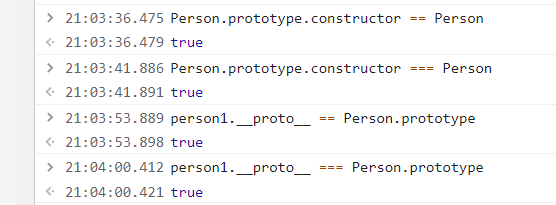

## 原型、原型链相等关系理解
- 首先我们要理解两个概念
    1. js 分为**函数对象**和**普通对象**，每一个对象都有 __proto__ 属性，但是只有函数对象才有 prototype 属性
    2. Object、Function 都是 js 内置的函数，类似的还有我们常用到的 Array、RegExp、Date、Boolean、Number、String

- 那么 __proto__ 和 prototype 到底是什么，两个概念的理解
    3. 属性 __proto__ 是一个对象，它有两个属性，constructor 和 __proto__
    4. 原型对象 prototype 有一个默认的 constructor 属性，用于记录实例是由哪个构造函数创建

> 有以下构造函数 Person，它的原型上有所属国属性 metherland='China'

```js
    function Person (name, age) {
        this.name = name;
        this.age = age;
    }

    Person.prototype.metherland = 'China';
```

> 通过 new Person() 创建 person1 实例

```js
    let person1 = new Person('小许', '18');
```

`js之父在设计js原型、原型链的时候遵从以下两个准则`
- 准则1: 原型对象（即 Person.prototype）的 constructor 指向构造函数本身
- 准则2：实例（即 person1）的 __proto__ 和原型对象指向同一个地方
```js
    1. Person.prototype.constructor == Person // **准则1：原型对象（即Person.prototype）的constructor指向构造函数本身**
    2. person1.__proto__ == Person.prototype // **准则2：实例（即person1）的__proto__和原型对象指向同一个地方**
```


## 原型、原型链的意思何在
> 思考，原型、原型链的意思何在？原型对象的作用，是用来存放实例中共有的那部份属性、方法，可以大大减少内存消耗。
- Person构造函数和person1实例举例说：
```js
    console.log(person1)
```

- 打印person01， 他有自己属性 name = '小明'，age = 18; 同时通过原型链关系，他有属性motherland = 'China'；

- 我们再创建person2实例
    ```js
        let person2 = new Person('小花', 20);
        console.log(person2)
    ```

- 打印 person2，它有自己属性 name='小花'，age='20'; 同时通过原型链关系，它有属性 metherland = 'China'; 看出来了，原型对象存在了 person1、person2 共有的属性所属国 metherland='china'。
- 我们不用在每一个实例上添加 metherland 属性，而是将这一属性存在他们的构造函数原型对象上，对于 Person 这样的构造函数。相同属性、方法还有很多，比如我们是黑头发，我们都有吃、睡的一些方法，当相同属性、方法越多，原型、原型链的意义越大。

- 我们可以这样操作
    ```js
        Person.prototype.hairColor = 'black';
        Person.prototype.eat = function(){
            console.log('We usually eat three meals a day.')
        }
        console.log(person1)
        console.log(person2)
    ```
- 此时我们再打印person1、person2，我们惊喜的发现，他们有了属性hairColor和eat方法；实例们动态的获得了Person构造函数之后添加的属性、方法，这是就是原型、原型链的意义所在！可以动态获取，可以节省内存。

> 另外我们还要注意：如果person1将头发染成了黄色，那么hairColor会是什么呢？
```js
    person1,hairColor = 'yellow'；
    console.log(person1)
    console.log(person2)
```

可以看到，person1 的 hairColor = 'yellow'， 而 person2 的 hairColor = 'black'；实例对象重写了原型上继承的属性、方法，相当于**属性覆盖、属性屏蔽**，这一操作不会改变原型上的属性、方法，自然也不会改变由统一构造函数创建的其他实例，只有修改原型对象上的属性、方法，才能改变其他实例通过原型链获得的属性、方法。