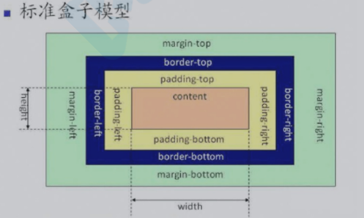

## css盒模型

### 什么是盒模型
当对一个文档进行布局（layout）的时候，浏览器的渲染引擎会根据标准之一的 CSS 基础框盒模型（CSS basic box model），将所有元素表示为一个个矩形的盒子（box）。

CSS 决定这些盒子的大小、位置以及属性（例如颜色、背景、边框尺寸…等）。盒模型由 content（内容）、padding（内边距）、border（边框）、margin（外边距）组成。


1. content：由内容边界限制，容纳着元素的“真实”内容，例如文本、图像，或是一个视频播放器。
2. padding：即内边距，负责延伸内容区域的背景（即内边距是透明的，受background影响），填充元素中内容与边框的间距。
3. border：即边框，围绕元素内容的内边距的一条或多条线，由粗细、样式、颜色三部分组成。
4. margin：即外边距，用空白区域扩展边框区域，以分开相邻的元素。


### 在CSS中，盒模型可以分为：

- W3C 标准盒模型
- IE 怪异盒模型

### 标准盒模型和怪异盒模型有什么区别？
在W3C标准下，我们定义元素的width值即为盒模型中的content的宽度值，height值即为盒模型中的content的⾼度值。 因此，标准盒模型下：
> 元素的宽度 = margin-left + border-left + padding-left + width + padding-right + border-right + margin-right




⽽IE怪异盒模型（IE8以下）width的宽度并不是content的宽度，⽽是border-left + padding-left + content的宽度值 + padding-right + border-right之和，height同理。

> 在怪异盒模型下： 元素占据的宽度 = margin-left + width + margin-right


+ 虽然现代浏览器默认使⽤W3C的标准盒模型，但是在不少情况下怪异盒模型更好⽤，于是W3C在css3中加⼊ box- sizing 。
```css
    box-sizing: content-box // 标准盒模型
    box-sizing: border-box // 怪异盒模型
    box-sizing: padding-box // ⽕狐的私有模型，没⼈⽤
```