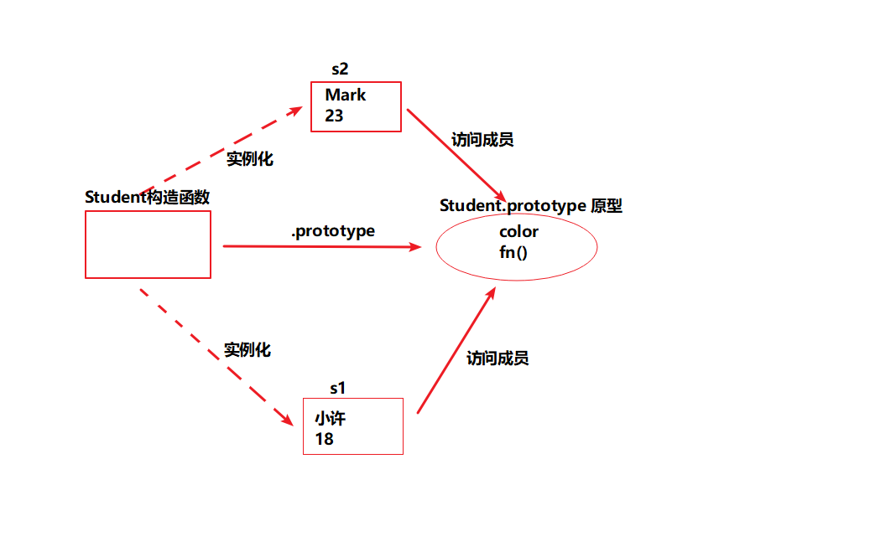

### 原型

- 1、什么是原型
    - 不管什么构造函数被声明，系统自动的会帮我们生成一个与之对应的对象，这个对象就是原型。

```js
    function Student (name, age) {
        this.name = name;
        this.age = age;
    }
```

- 2、如何访问这个原型对象
    - 构造函数名.prototype
    ```js
        console.log(Student.prototype);
    ```

- 3、既然原型是一个对象，那能否往这个对象中添加成员（属性和方法）
    - 答案肯定是可以的
    ```js
        Student.prtotype.color = 'red';
        Student.prtotype.['fn'] = function() {
            console.log('我是fn...')
        }
        // console.log(Student.prototype['color']);
        // Student.prototype.fn();
    ```

- 4、原型中添加的成员，谁可以访问？
    - 原型自己可以访问 Student.prtotype.
    - 原型对应的构造函数实例化的成员们
    ```js
        // 实例化学生对象
        let s1 = new Student('小许', 18)
        console.log(s1.color); // red

        let s2 = new Student('Mark', 23)
        s1.fn(); // 我是fn...
    ```
    

- 5、使用原型优点
    - 会节约内存空间
    - 不会造成全局变量污染
    - 原型对象又不需要我们去声明，系统会自动创建的
    ```js
        console.log(s1.fn === s2.fn); // true
    ```