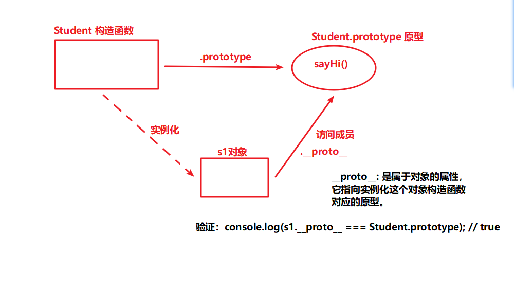

## `__proro__`属性
- 属于对象的属性，它指向谁呢？指向实例化这个对象的构造函数对应的原型

```js
    function Student(name, age) {
        this.name = name;
        this.age = age;
    }
    // 每一个学生打招呼都一样，可以写在原型中
    Student.prototype.sayHi = function() {
        console.log("你好，我是学生，我的名字叫" + this.name);
    }
    // 实例化学生对象
    let s1 = new Student("小许", 18);
    // s1.sayHi();
    console.log(s1.__proto__);

    // 验证
    console.log(s1.__proto__ === Student.prototype); // true

```



##### 总结
- `.__proto__ `属性指向原型，都可以用这种给原型添加成员
- 但实际开发中一般不会这样用，因为` __proto__ `不是w3c的属性
- 实际开发中要给原型添加成员，应该用 构造函数名 .prototype 这种方式
- 平时学习，测试，验证某些数据的时候是可以用的
```js
    s1.__proto__.color = 'red';
    console.log(Student.prototype);
```