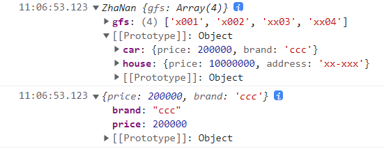
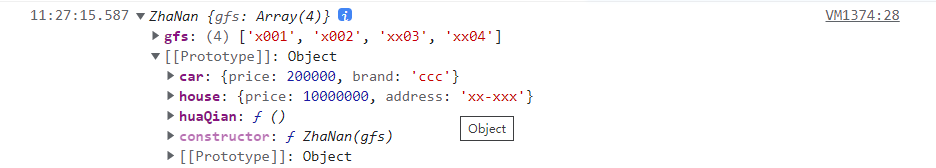

## js 继承

### 继承的实现方式

#### 1、混入式继承
```js
    let wangjianlin = {
        house: {
            price: 10000000,
            address: 'xx-xxx',
        },
        car: {
            price: 200000,
            brand: 'ccc',
        }
    };

    let wangsicong = {
        girlFriends: ['xxx', 'ccc', 'aaa', '123'],
    }

    // wangsicong 对象想拥有 wangjianlin这个对象里面的 house 和 car，就可以让 wangsicong 继承自 wangjianlin 这个对象
    for(let key in wangjianlin) {
        wangsicong[key] = wangjianlin[key];
    }
    console.log(wangsicong);
```

#### 2、替换原型式继承
- 简单粗暴 直接替换原型对象`prototype`, 缺点的也很明显，原来的原型有自己的属性或者方法会把原来原型里的属性或者方法都干掉
```js
    let wangjianlin = {
        house: {
            price: 10000000,
            address: 'xx-xxx',
        },
        car: {
            price: 200000,
            brand: 'ccc',
        }
    };

    // 构造函数
    function ZhaNan(gfs) {
        this.gfs = gfs;
    }

    // 替换原型继承
    ZhaNan.prototype = wangjianlin;

    // 实例化一个渣男对象
    let wangsicong = new ZhaNan(['x001', 'x002', 'xx03', 'xx04']);

    console.log(wangsicong);
    console.log(wangsicong.car);

```



#### 3、混合式继承
- 混合式继承：给原型对象添加成员（属性、方法）
```js
    let wangjianlin = {
        house: {
            price: 10000000,
            address: 'xx-xxx',
        },
        car: {
            price: 200000,
            brand: 'ccc',
        }
    };

    // 构造函数
    function ZhaNan(gfs) {
        this.gfs = gfs;
    }
    ZhaNan.prototype.huaQian = function() {
        console.log('huanQian...........')
    }

    // 混合式继承 给原型添加成员
    for (let key in wangjianlin) {
        ZhaNan.prototype[key] = wangjianlin[key]
    }

    // 实例化一个渣男对象
    let wangsicong = new ZhaNan(['x001', 'x002', 'xx03', 'xx04']);

    console.log(wangsicong);
```
