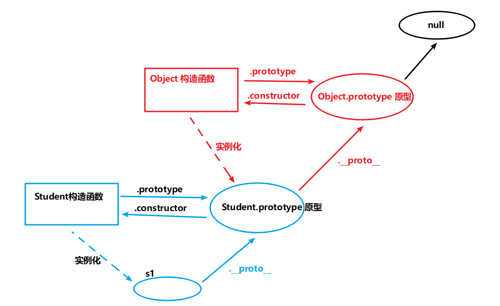
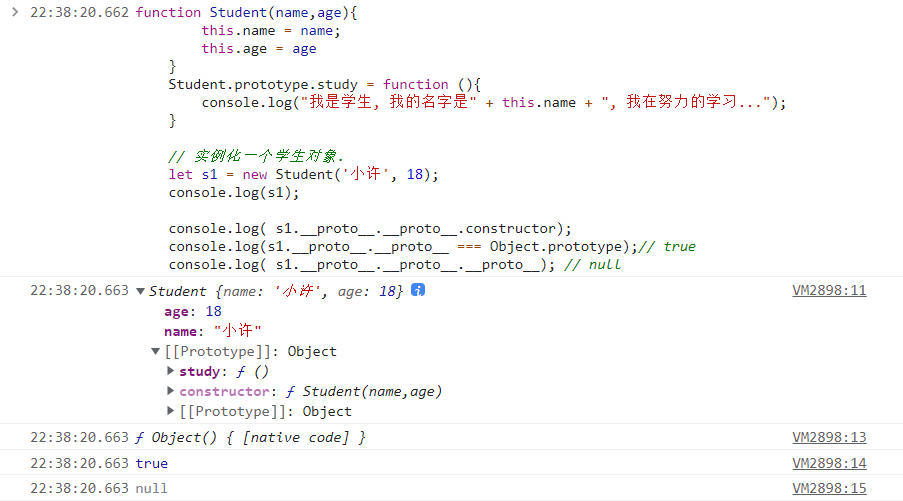

### 原型链

- 对象都有原型（都有 .__proto__ 属性），那原型也是对象，所以原型也有原型，这样形成了一个链式结构，称为**原型链**。
- 作用：
    - 对象访问成员的访问规则：
        - 如果访问的成员对象自己有，就访问自己的，如果对象自己没有就访问原型的
        - 如果原型也没有就沿着原型链一只往上查找，直到找到为止
        - 如果找到头还没有找到就返回 undefined 或者 报错



```js
    function Student(name,age){
        this.name = name;
        this.age = age
    }
    Student.prototype.study = function (){
        console.log("我是学生, 我的名字是" + this.name + ", 我在努力的学习...");
    }

    // 实例化一个学生对象.
    let s1 = new Student('小许', 18);
    console.log(s1);

    console.log( s1.__proto__.__proto__.constructor);
    console.log(s1.__proto__.__proto__ === Object.prototype);// true
    console.log( s1.__proto__.__proto__.__proto__); // null
```
