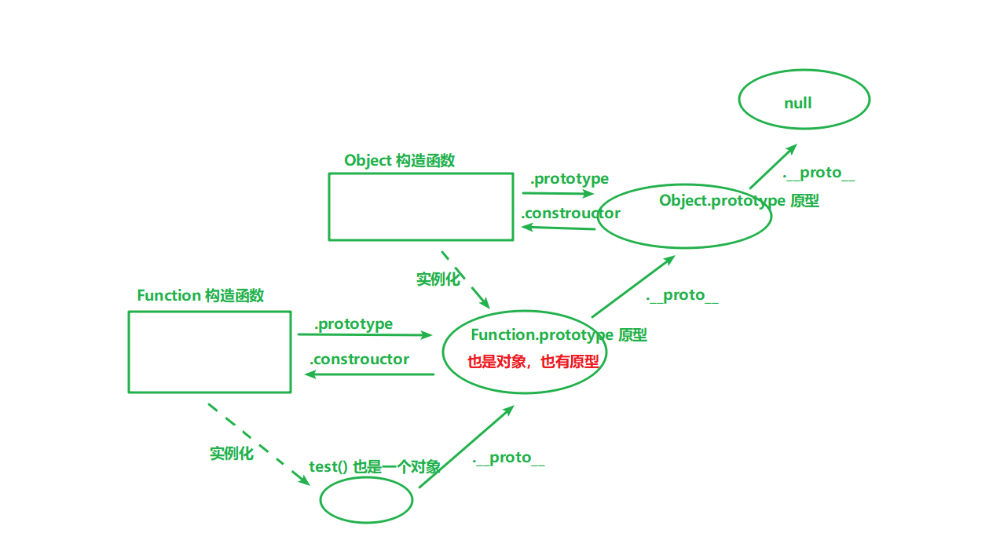

### 函数也是对象

#### 1、函数是一个对象
```js
    function test() {
        console.log('我是 test 函数...');
    }
    // 给函数添加属性 和 方法 不会报错 也能正常输出 可看出函数也是一个对象
    test.color = 'red';
    test.fn = function() {
        console.log('我是添加的 fn ...');
    }

    console.log(test.color); // red
    test.fn(); // 我是添加的 fn ...
```

#### 2、既然函数是一个对象，那这个对象是由哪个构造函数实例化出来的？
- 是由 Function() 构造函数实例化出来的
```js
    console.log(test.__proto__.constructor); // Function
    console.log(test.__proto__ === Function.prototype); // true

    console.log(test.__proto__.__proto__.constructor); // Object
    console.log(test.__proto__.__proto__ === Object.prototype); // true
```


#### 函数是由Function()这个构造函数创建的
- 实例化一个 无参无函数体无返回值 函数
    ```js
        let fn1 = new Function();
        console.log(fn1);
    ```

- 实例化一个 有函数体 函数
    ```js
        let fn2 = new Function("console.log('我是一个用Function配和new关键字实例化的一个函数')");
        fn2();
    ```

- 实例化一个 有参数有函数体 函数
    ```js
        let fn3 = new Function('a', 'b', 'console.log(a + b)');
        fn3(1, 2); // 3
    ```

- 实例化了一个  有参数有函数体有返回值  函数
     ```js
        let fn4 = new Function('a', 'b', 'console.log("xxhh"); return a +b;');
        console.log(fn4(10, 30)); // xxhh 40
    ```

**平时声明一个函数**，已经自动想上面一样帮我们实例化函数
```js
    //a.
    function test1(){

    }

    //b
    var test2 = function(){

    }
```