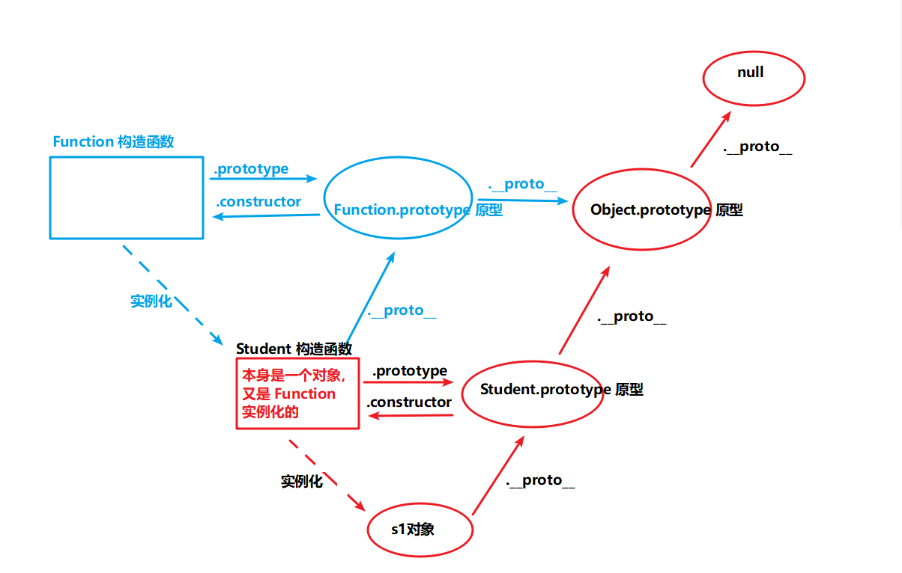

### 构造函数也是对象

- 构造函数也是函数，所以也是对象
    ```js
        function Student(name, age) {
            this.name = name;
            this.age = age;
        }
        // 给 构造函数 添加属性 和 方法 不会报错 也能正常输出 可看出函数也是一个对象
        Student.sb = "随便";
        Student.dsb = function(){
            console.log("你是一个大随便");
        }
        console.log(Student.sb); // 随便
        Student.dsb(); // 大随便

        // 实例化一个学生对象
        let s1 = new Student('Mark', 24);
    ```

- 构造函数也是由 Function 构造函数实例化出来的对象
    ```js
        let s1 = new Student('Mark', 24);
        console.log(Student.__proto__.constructor); // Function
        console.log(Student.__proto__ === Function.prototype); // true

        console.log(Student.__proto__.__proto__.constructor); // Object
        console.log(Student.__proto__.__proto__ === Object.prototype); // true
    ```


