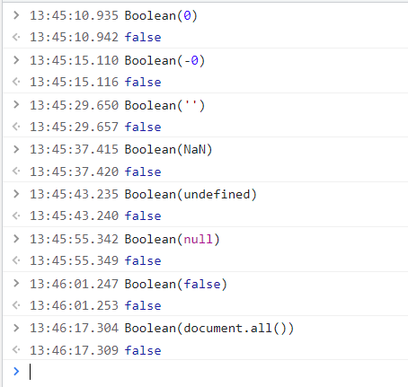

## js 隐式转换

### 1、什么是隐式转换
定义：由编译器自动完成类型转换的方式就称为隐式转换

### 2、转换规则

#### 2.1、基本数据类型

##### 2.1.1、将值转换为字符串
- 字符串连接符 `+` （只要 + 两边出现字符串就是字符串连接符）
    - 编译器将非 string 类型的值转为 string 类型，然后再将其拼接成一个新的字符串
    ```js
        let test = 1 + '0' + undefined + true + null;
        console.log(test); // 10undefinedtruenull
        console.log(typeof test); // string
    ```

##### 2.1.2、将值转为数字（Number()函数）
- 自增/自减 运算符，算数运算符，关系运算符 使用这规则
    
|  序号   | 其他类型  |  转换为 number 类型后的值 |
|  ----  | ----  | -----  |
| 1  | undefined |  NaN |
| 2  | null |  0 |
| 1  | boolean |  true转为1；false转为0 |
| 1  | string |  left-aligned 空字符串`''`, ""转为0，'123'转为数值123; hello 和 a123 转为 NaN |
- 这里对关系运算符中的几种情况进行说明
    1. 字符串与字符串比较
        - 比较的方法（<> >= <= !=）：通过依次比较字符串中每个字符所对应的 unicode 的值，若比较过程中能得出结果，直接返回结果并且不再比较后面的字符
        - 通过字符串的 charCodeAt() 方法可以查看每个字符的 unicode
        - 该方法的用法及细节请参考链接：MDN String.proptype.charCodeAt() 文档：https://developer.mozilla.org/zh-CN/docs/Web/JavaScript/Reference/Global_Objects/String/charCodeAt
        - 比较方法（==）：只有两个相同的字符串比较才为true。

    2. null 与 undefined
    |  序号   | 关系式  | 结果 |
    |  ----  | ----  | -----  |
    | 1  | undefined == undefined |  true |
    | 2  | null == null | true |
    | 3  | null == undefined |  true |
    > Javascript规范中，规定 null 和 undefined 是相等的。null 和 undefined 都代表着无效的值


    3. NaN 
        - NaN 代表非数值的特殊值，用于指示某个值不是正确数字。NaN 与任何类型的值比较都是 false，包括本身 NaN

##### 2.1.3、将值转为布尔值（Boolean()函数）

- 逻辑非运算符 `!` 使用这一规则。编译器通过 Boolean() 函数将非布尔类型的值转为布尔值
    - 以下几种情况转换成布尔类型会得到false，其他的全为 true

    |  序号   | 值  | 备注 |
    |  ----  | ----  | -----  |
    | 1  | 0 |  number类型 |
    | 2  | -0 | number类型 |
    | 3  | '' |  空字符串；空格是为true `' '` |
    | 4  | NaN |  number 类型 |
    | 5  | undefined |  undefined类型 |
    | 6  | null |  null类型 |
    | 7  | false |  Boolean类型 |
    | 8  | document.all() |   |

    


#### 2.2 引用数据类型

##### 2.2.1 引用数据类型相互比较
- 比较的是引用数据类型的指向的地址
    ```js
        console.log([] == []); // false 两个空数组指向不同的地址

        const a = [];
        const b = a;
        console.log(a == b); // true 数组a，数组b 指向相同的地址
    ```

文章：https://blog.csdn.net/m0_37622071/article/details/113514845