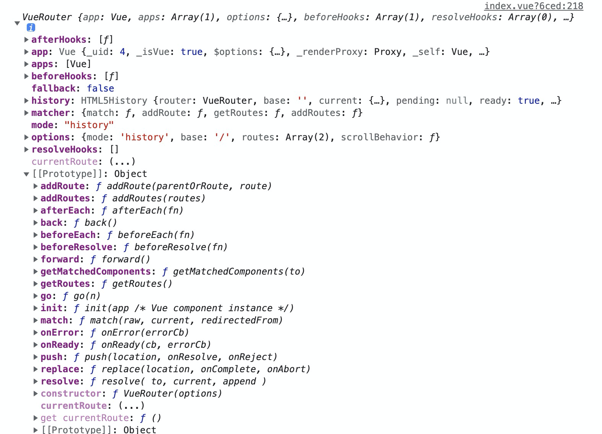
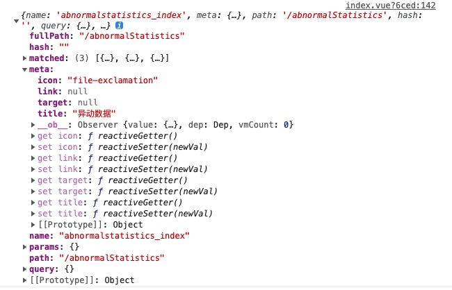

### vue中router与route区别

#### $router 对象
- $router 对象是全局路由的实例，是router构造方法的实例

##### 路由实例方法：
1. push
    - 字符串：this.$router.push('home')
    - 对象：this.$router.push({path: '/home'})
    - 命名的路由参数：this.$router.push({name: 'user', params: {ueserId: 123}})
    - 带查询参数/register?plan=123 ： this.$router.push({path:'register',query:{plan:'123'}})
    
    **注意：**
    1. push方法其实和<router-link :to="...">是等同的。
    2. push方法的跳转会向 history 栈添加一个新的记录，当我们点击浏览器的返回按钮时可以看到之前的页面。

2. go
    - 页面路由跳转 
    - 前进或者后退this.$router.go(-1)  // 后退

3. replace
    push 方法会向 history 栈添加一个新纪录，而 replace 方法是替换当前的页面，不会向 history 栈添加一个新的记录

4. 一般使用 replace 来做 404 页面
    this.$router.replace('/')
    配置路由时path有时候会加 '/' 有时候不加, 以'/'开头的会被当作根路径，就不会一直嵌套之前的路径。

#### $route 对象
- $route对象表示当前的路由信息，包含了当前 URL 解析得到的信息。包含当前的路径，参数，query对象等。

1. $route.path
    字符串，对应当前路由路径，总是解析为绝对路径，如"/foo/bar"

2. $route.params
    一个 key/value 对象，包含了动态片段 和 全匹配片段，如果没有路由参数，就是一个空对象

3. $route.query

    一个 key/value 对象，表示 URL 查询参数。例如，对于路径 /foo?user=1，则有$route.query.user == 1，如果没有查询参数，则是个空对象。

4. $route.hash
    当前路由的hash值 (不带#) ，如果没有 hash 值，则为空字符串。

5. $route.fullPath
    完成解析后的 URL，包含查询参数和hash的完整路径。

6. $route.matched
    数组，包含当前匹配的路径中所包含的所有片段所对应的配置参数对象。

7. $route.name 
    当前路径名字

8. $route.meta
    路由元信息

