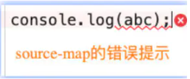

### webpack之souce-map

#### 1. 认识 souce-map

- 我们的代码通常运行在浏览器上时, 是通过打包压缩的, 但是, 当代码报错需要调试时(debug), 调试转换后的代码是困难的, 我们不能保证代码不出错, souce-map出现了, 是从已转换的代码, 映射到源文件, 使浏览器可以重构原始源并在调试器显示重建的原始源

#### 1.1 如何使用 source-map

- 第一步: 根据源文件, 生成 source-map 文件, webpack在打包时, 可以通过配置生成 source-map

`webpack.config.js`

```js
    module.exports = {
        mode: "development",
        devtool: "source-map"
    }
```

- 第二步: 在转换后的代码, 最后加一个注释, 它指向 source-map

`bundle.js`

```js
    // # sourceMappingURL=bundle.js.map
```

#### 2 生成 source-map

- 如何使用 webpack 打包的时候, 生成对应的 source-map ?
  - wenbpack为我们提供了非常多选项(目前是26个), 来处理 source-map [官网地址](https://webpack.docschina.org/configuration/devtool/)
  - 选择不同的值, 生成的 source-map 会稍微有差异, 打包过程也会有性能的差异, 可以根据不同情况进行选择
  - 下面几个值不会生成 source-map:
    - false: 不使用 source-map, 也就是没有任何和 source-map 相关的内容
    - (none): production 模式下的默认值(什么都不写), 不生成 source-map
    - eval: development 模式下的默认值, 不生成 source-map, 但它会在 eval 执行的代码中. 添加 // #sourceURL=, 它会被浏览器在执行时解析, 并且在调试面板中生成对应的一些文件目录, 方便我们调试代码

`webpack.config.js`

```js
    module.exports = {
        mode: "development", // development模式 devtool的默认值是 eval
        devtool: "eval",
    }
```

`bundle.js`

```js
    eval("const sum = (a, b) => a + b\r\nconst mul = (a, b) => a * b\r\n\r\nmodule.exports = {\r\n  sum,\r\n  mul\r\n}\n\n//# sourceURL=webpack://webpack5/./src/js/content.js?");
```

> 我们会发现eval函数最后面有/# sourceURL=webpack://webpack5/./src/js/content.js?，浏览器能通过它生成对应的一些文件目录，方便我们调试代码。

#### 2.1 source-map 值

- 生成一个独立的 source-map 文件, 并且在 bundle 文件中有一个注释, 指向 source-map 文件

- bundle.js 文件中有如下注释:

```js
    // # sourceMappingURL=bundle.js.map
```

> 开发工具会根据这个注释找到这个 source-map 文件, 并且解析

#### 2.2 eval-source-map 值

- eval-source-map 会生成 source-map, 但是 source-map 是以 DataUrl 添加到 eval 函数后面

#### 2.3 inline-source-map 值

- inline-source-map 会生成 sourcemap, 但是 source-map 是以 DatsUrl 添加到 bundle 文件后面

#### 2.4 cheap-source-map 值

- cheap-scorce-map 会生成 sourcemap, 但是会更加高效一些(cheap 低开销), 因为它没有生成列映射(Column Mapping), 在开发中, 我们只需要行信息通常就可以定位到错误了



#### 2.5 cheap-module-source-map 值

- cheap-module-source-map 会生成 sourcemap, 类似于 cheap-source-map, 但是对源自 loader 的 sourcemap处理会更好
- 这里有一个很模糊的概念: 对源自 loader的 sourcemap处理会更好, 官方也没有给出很好的解释, 其实是 如果loader对我们源代码进行了特殊处理, 比如 babel; 当代码被 loader 处理后, 使用 cheap-module-sourc-map 处理效果会更好

#### 2.6 hidden-source-map 值

- hidden-source-map 会生成 sourcemap, 但不会对 source-map 文件进行引用, 相当于删除了打包文件中的 sourcemap 的引用注释

```js
    // 被删除的
    // # sourceMappingURL=bundle.js.map
```

> 如果我们手动添加进来, 那么 sourcemap就会生效了

#### 2.7 nosource-source-map 值

- nosource-source-map 会生成 sourcemap, 但是生成的 sourcemap 只有错误信息的提示, 不会生成源代码文件; 点击错误提示, 无法查看源码

### 多个值的组合

- 事实上, webpack 提供给我们的 26 个值, 是可以进行多组合的
- 组合规则如下:
  - inline | hidden | eval : 三个值时三选一
  - nosource: 可选值
  - cheap 可选值, 并且可以随 module 的值

  ```js
    [inline-|hidden-|eval-][nosources-][cheap-[module]]source-map
  ```

### 总结

- 开发阶段: 推荐使用 source-map 或者 cheap-module-source-map, 这分别是 vue 和 react 使用的值, 可以获取调试信息, 方便快速开发
- 测试阶段: 推荐使用 source-map 或者 cheap-module-source-map, 测试阶段问问面也希望在浏览器下看到正确的错误提示
- 发布阶段: false, 缺省值(不写)
