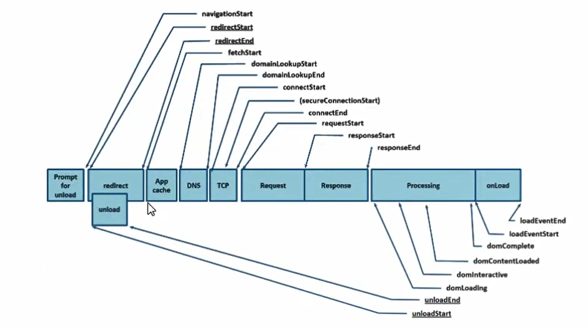

## 浏览器渲染原理

### 一 进程与线程

- 进程是操作系统资源分配的基本单位, 进程中包含线程
- 线程是由进程所管理的; 为了提升浏览器的稳定性和安全性, 浏览器采用了多进程模型

#### 浏览器中的五个进程


- **浏览器进程**: 负责界面显示, 用户交互, 子进程管理, 提供存储等
- **渲染进程**: 每个页卡都有单独的渲染进程, 核心用于渲染页面
- **网络进程**: 主要处理网络资源加载(HTML CSS JS 等)
- **GPU进程**: 3d 绘制, 提高性能
- **插件进程**: chrome中安装的一些插件

### 二 从输入URL到浏览器显示页面发生了什么?

> 用户输入的是关键字还是URL? 如果是关键字则用使用默认搜索引擎生成URL

#### 1. 浏览器进程是相互调用

- 在浏览器进程中输入 url 地址开始导航, 并准备渲染进程
- 在网络进程中发送请求, 加载资源, 将响应后的结果交给渲染进程处理
- 解析页面, 加载页面所需资源

#### 2. URL 请求过程

- 网络七层模型 (物理层 数) 网(ip)  传(tcp 安全可靠,可分段传输; udp 丢包)  (会 表 应) http
- 先去查找缓存, 检测缓存是否过去; 直接返回缓存中内容
- 看域名是否被解析过, DNS协议, 将域名解析成ip地址(DNS 基于 UDP) ip+端口号 host
- 请求是 HTTPS SSL协商
- ip地址来进行寻址, 排队等待, 最多能发送 6个http请求
- tcp 创建链接, 用于传输(三次握手)
- 利用tcp传输数据 (拆分成数据包, 有序, 可靠) 服务器会按照顺序来接收
- http 请求(请求行, 请求头, 请求体)
- 默认不会端开 keep-alive 为了下次传输数据时,可以复用上次的创建的链接
- 服务器收到数据后(响应行, 响应头, 响应体)
- 服务器返回 301 302 会进行重定向操作
- 服务器 304 去查询浏览器缓存进行返回

> 浏览器接受资源后怎么处理

#### 3. HTTP 发展历程

http 0.9 负责传输html, 最早的时候没有请求头和响应头
http 1.0 提供了 header; 根据header的不同来处理不同的资源
http 1.1 默认开启了 keep-alive 链接复用; 管线化; 服务器处理多个请求(队头阻塞问题)
http 2.0 用同一个 tcp 链接来发送数据, 一个域名一个tcp(多路复用); 头部压缩; 服务器可以推送数据给客户端
http 3.0 解决了tcp的队头阻塞问题; 采用QUIC 协议,采用了udp

#### 4. 渲染流程


- 1. 浏览器无法直接使用 HTML, 需要将 HTML 转化成 DOM 树(document)
- 2. 浏览器无法解析纯文本的css 样式,需要对 css 进行解析, 解析成 styleSheets, CSSOM (document.styleSeets)
- 3. 计算出DOM树中每个节点的具体样式(Attachment)
- 4. 创建渲染(布局)树, 将DOM树中可见节点, 添加到布局树中; 并计算节点渲染到页面的坐标位置(layout)
- 5. 通过布局树,进行分层(根据定位属性, 透明属性, transform属性, clip属性等) 生成图层树
- 6. 将不同图层进行绘制, 转交给合成线程处理; 最终生成页面, 并显示到浏览器上(Painting, Display)

#### dom生成

- 在解析前会执行预解析操作, 会预先加载 js, css 等文件
- 字节流 -> 分词器 -> Tokens -> 根据token生成节点 -> 插入到DOM树中
- 遇到 js: 在解析过程中遇到 script 标签, HTMLParser 会停止解析, (下载)执行对应脚本
- 在 js 执行前, 需要等待当前脚本之上的所有 css 加载解析完毕 (js 是依赖 css 的加载)


- 为什么css放上面 js放下面??

### 三 perfromance API



|  关键事件节点   | 描述  | 含义 |
|  ----  | ----  | -----  |
| TTFB  | time to frist byts(首字节时间) |  从请求到数据返回第一个字节所消耗时间 |
| TTI  | Time to Interactive | DOM树构建完成, 代表可以绑定事件 |
| DCL  | DOMContentLoaded(事件消耗时间) | 当 HTML 文档被完全加载和解析完成后, DOMContentLoaded事件被触发 |
|  L | onLoad(事件耗时) | 当依赖的资源全部加载完毕后才会触发 |
| FP  | First Paint(首次绘制) | 第一个像素绘制到屏幕的时间 |
| FCP  | First Contentful Paint(首次内容绘制) | 首次绘制任何文本, 像素, 非空白节点的时间 |
| FMP  | First Meaningful Paint(首次有意义绘制) | 首次有意义绘制是页面可用性的量度标准 |
| LCP  | Largest Contentful Paint(最大内容渲染) | 在 viewport 中最大的页面元素加载时间 |
| FID  | First Input Delay(首次输入延迟) | 用户首次和页面交互(单击链接, 点击按钮等) 到页面响应交互的时间 |

### 四 网络优化策略

- 减少 HTTP 请求数, 合并js, css, 合理内嵌 css, js
- 合理设置服务器缓存, 提高服务器处理速度 (强制缓存, 对比缓存)

```js
    // Expires/Cache-Control   Etag/if-none-match/last-modified/if-modified-sine
```

- 避免重定向, 重定向会降低响应速度(301 302)
- 使用 dns-prefetch, 进行 DNS 预解析
- 采用域名分片技术, 将资源放到不同的域名下, 接触同一个域名最多处理 6个 tcp 链接问题
- 采用 CDN 加速加快访问速度(指派最近, 高度可用)
- gzip 压缩优化 对传输资源进行体积压缩(html, js, css)

```js
    // Content-Encoding: gzip
```

- 加载数据优先级: preload (预先请求当前页面所需要的资源) prefetch(将来页面使用的资源) 将数据缓存到 HTTP 缓存中

```js
    <link rel="preload" href="style.css" as="style">
```

### 五 关键渲染路径


- 重排(回流)Reflow: 添加元素, 删除元素, 修改大小, 位置元素位置, 获取位置相关信息
- 重绘 Repaint: 页面中元素样式的改变并不影响他在文档流中的位置

> 应该尽可能减少重绘和重排

1. 强制同步布局问题

    - javascrip 强制将计算样式和布局操作提前到当前任务中

    ```html
        <div id="app"></div>
        <script>
            function reflow() {
                let el = documnet.getElementById('app');
                let node = document.createElement('h1');
                node.innerHTML = 'hello';
                el.appendChild(node);
                // 强制同步布局
                console.log(app.offsetHeight); // 在这 获取位置就会导致 重排(重新布局) // 优化: 放到函数外面  读写分离
            }
            window.addEventListener('laod', function() {
                reflow()
            });

            // ===========
            function reflow1() {

                let el = documnet.getElementById('app');
                let node = document.createElement('h1');
                node.innerHTML = 'hello';
                el.appendChild(node);
                // 强制同步布局
                console.log(app.offsetTop); // 不停的在触发布局
            }
            window.addEventListener('load', function() {
                for(let i = 0; i < 100; i++) {
                    reflow1()
                }
            })
        </script>
    ```

2. 布局抖动(layout thrashing)问题

    - 在一段js代码中, 反复执行布局操作, 就是布局抖动
    > 例子看上面 `reflow1`

3. 减少回流和重绘

    - 脱离文档流
    - 渲染图片时给图片增加固定宽高 浏览器一开始不知道图片宽高
    - 尽量使用 css3 动画
    - 可以使用 will-change 提取大单独的图层中 (除非知道很耗性能,又没有用定位,css3 时,可以加上整个)

    ```html
        <div style="will-change: transform;"></div>
    ```

### 静态文件优化

1. 图片优化

    - 图片格式
        - `jpg`: 适合色彩丰富的照片, banner图; 不适合图形文字, 图标(纹理边缘有锯齿), 不支持透明度
        - `png`: 适合纯色, 透明, 图标, 支持半透明; 不适合色彩丰富图片, 因为无损存储会导致存储体积大
        - `gif`: 适合动画, 可以动的图标; 不支持半透明, 不适合存储彩色图片
        - `webp`: 适合半透明图片, 可以保证图片质量和较小的体积
        - `svg`: 格式图片: 相比于 `jpg` 和 `png` 他的体积更小, 渲染成本过高, 适合小且色彩单一的图标
    - 图片优化:
        - 避免空 src 的图片
        - 减少图片尺寸, 节约用户流量
        - img 标签设置 alt 属性, 提升图片加载失败时的用户体验
        - 原生的 loading:lazy 图片懒加载

            ```html
                
            ```

        - 不同环境下, 加载不同尺寸和像素的图片

            ```html
                
            ```

        - 对于较大的图片可以采用渐进式图片
        - 采用 best64URL 减少图片请求 (缺陷 文件体积会变大 转码)
        - 采用雪碧图合并图标图片等

2. HTML 优化

    - 语义化 HTML: 代码简洁清晰, 利于搜索引擎,便于团队开发
    - 提前声明字符编码, 让浏览器快速确定如何渲染网页内容
    - 减少 HTML 嵌套关系, 减少 DOM 节点数量
    - 删除多余空格, 空行, 注释, 及无用的属性等
    - HTML 减少 iframes 使用(iframes会阻塞 onload事件, 可以动态去加载 iframes)
    - 避免使用table布局

3. CSS 优化

    - 减少伪类选择器, 减少样式层数, 减少使用通配符
    - 避免使用 css 表达式, css 表达式会频繁求值, 当滚动页面, 或者移动鼠标时都会重新计算

        ```css
            background-color: expression((new Date()).getHours() % 2 ? "red" : "yellow");
        ```

    - 删除空行, 注释, 减少无意义的单位, css 进行压缩
    - 使用外链 css, 可以对 css 进行缓存
    - 添加媒体字段, 只加载有效的 css 文件

        ```html
            <link href="index.css" rel="stylesheet" media="screen and (main-width: 1024px)" />
        ```

    - CSS contain 属性,将元素进行隔离
    - 减少 @import 使用, 由于 @import 采用的是串行加载

4. JS 优化

    - 通过 async, defer 异步加载文件

    

    - 减少DOM操作, 缓存访问过的元素
    - 操作不直接应用到 DOM 上, 而应用到虚拟 DOM 上; 最后一次性的应用到 DOM 上
    - 使用 webworker 解决程序阻塞问题
    - IntersectionObserver (页面很多图片 滚动)

        ```js
            // 监控出现可视区域内
            const observer = new IntersectionObserver(function(changes) {
                changes.forEach(function(element, index) {
                    if (element.intersectionRatio > 0) {
                        oberver.unobserver(element.target);
                        element.target.src = element.target.dataset.src;
                    }
                });
            });

            function initObserver() {
                const listItems = documnet.querySelectorAll('img');
                listItems.forEach(function(item) {
                    observer.observer(item);
                });
            };
            initObserver();
        ```

    - 虚拟滚动 `vertual-scroll-list`
    - `requestAnimationFrame`: 动画 `requestIdleCallback`: 某一帧渲染完剩余时间 idcallback
    
    - 尽量避免使用 `eval`, 消耗时间久
    - 使用事件委托, 减少事件绑定个数
    - 尽量使用 canvas 动画, css动画

5. 字体优化

    - FOUT(Flash Of Unstyled Text): 等待一段时间,如果没加载完成,先显示默认, 加载后在进行替换
    - FOIT(Flash Of Invisible Text): 字体加载完毕后显示,加载超时降低系统字体(白屏)

### 优化策略

- 关键资源个数越多, 首次页面加载时间会越长
- 关键资源的大小, 内容越小, 下载时间越短
- 优化白屏: 内联 css 和 内联js 移除文件下载较小文件体积
- 预渲染,打包时进行预渲染
- 使用 ssr 加速首屏加载(耗费服务端资源), 有利于seo优化, 首屏利用服务端渲染,后续交互采用客户端渲染
