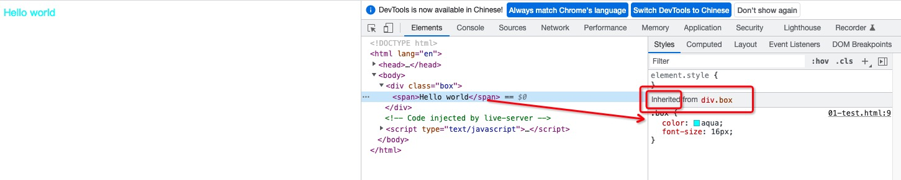
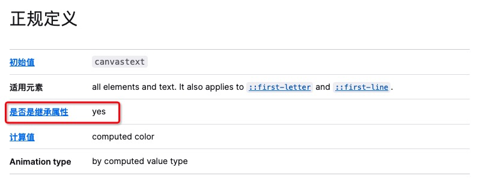
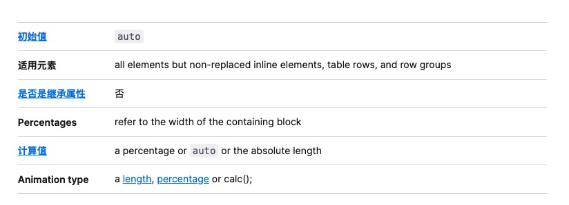
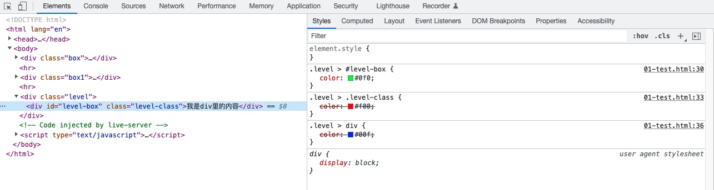

### 基础

#### js

1. js基本数据类型和引用类型分别是什么，哪些数据类型是放在栈内存中，哪些类型是放在堆内存中 ，区别是什么


2. 什么是继承，有几种，哪几种，各自的优缺点？call、apply和bind的区别

3. 什么是闭包，它的优缺点是什么？for in 和for of 区别  适合用于哪些场景

4. 什么是事件委托

5. 什么是微任务和宏任务，异步里的微任务先还是宏任务先

6. 用过哪些es6语法，Map和Set 的区别，for in 和for of 区别  适合用于哪些场景，解构是深拷贝还是浅拷贝？


7. js垃圾回收机制的原理是什么

8. 浏览器渲染流程是怎样的 


9. 浏览器缓存机制是怎样的？


#### css

1. CSS 中哪些属性可以继承？
    - css 中有一些属性是可以继承的，什么是属性的继承？
        - 一个元素如果没有设置某些属性的值，就会跟随（继承）父元素的属性值。当然，一个元素如果有自己设置的属性值，就会使用自己的。
        - 比如 color、font-size 等属性是可以继承的，怎样查看某些属性是继承父元素的，还是自己设置的？（可通过浏览器调试工具查看）

    - 如下示例：给父元素 div 设置字体样式
    ```html
        <style>
            .box {
                color: aqua;
                font-size: 16px;
            }
        </style>
        <body>
            <div class="box">
                <span>Hello world</span>
            </div>
        </body>
    ```
    浏览器运行结果：span元素内容字体颜色变成红色、大小变成16px，并且标识样式是继承于 div.box；
    

    - 那么哪些样式可以继承哪些样式不能继承，具体属性是否能继承，可以查阅[W3C官网](https://www.w3.org/)或者[MDN](https://developer.mozilla.org/zh-CN/)。

    以MDN为例：输入需要查找的属性（color是可以继承的、width是不能继承的）
    - color
        
    - width
        

    - 不能继承的属性可以使用 `inherit` 属性强制继承。
    **注意**：css属性继承的计算值，并不是编写属性时的指定值（也就是字面值）

    - 如下示例：
        ```html
            <style>
                .box1 {
                    width: 1000px;
                    height: 150px;
                    background-color: #f00;
                }
                .box2 {
                    width: 50%; /* 500px */
                    height: 100px;
                    background-color: #00f;
                }
                .box3 {
                    width: inherit; /* 250px */
                    height: 50px;
                    background-color: #0f0;
                }
            </style>
            <body>
                <div class="box1">
                    <div class="box2">
                        <div class="box3"></div>
                    </div>
                </div>
            </body>
        ```
    运行结果：div.box3 是直接继承 div.box2 计算后的 250px；

2. 伪类与伪元素的区别
    - w3c 中对于它们是这么解释的
        - 伪类：用于某些选择器添加特殊的效果，定义元素的特殊状态
            - 设置鼠标悬停在元素上时的样式
            - 为已访问和未访问链接设置不同的样式
        - 伪元素：用于设置元素指定部分的样式
            - 设置元素的首字母、首行的样式
            - 在元素的内容之前或之后插入内容
    
    - CSS 伪类

    |  选择器   | 例子  | 例子描述 |
    |  ----  | ----  | -----  |
    | :active  | a:active |  选择活动的链接 |
    | :hover  | a:hover | 选择鼠标悬停其上的链接 |
    | :focus  | input:focus |  选择获得焦点的 `<input>` 元素 |

    - CSS 伪元素

    |  选择器   | 例子  | 例子描述 |
    |  ----  | ----  | -----  |
    | ::after  | p::after |  在每个 `<p>` 元素之后插入内容 |
    | ::before  | p::before | 在每个 `<p>` 元素之前插入内容 |
    | ::first-letter  | p::first-letter |  选择每个 `<p>` 元素的首字母 |
    | ::first-line  | p::first-line |  选择每个 `<p>` 元素的首行 |
    | ::selection  | p::::selection |  选择用户选择的元素部分 |

    **总结**
    - 伪类和伪元素都是用于向选择器加特殊效果
    - 伪类和伪元素的本质区别就是 是否抽象创造了新元素
    - 伪类只要不是互斥，可以叠加使用
    - 伪元素在一个选择器中只能出现一次，并且只能出现在末尾
    - 伪类和伪元素优先级分别与类、标签优先级相同


3. CSS 优先级算法如何计算？
    首先
    - 理解 css属性的 层叠
        - CSS全称 (Cascading Style Sheets，层叠样式表），它允许多个相同名字的css属性层叠在同一个元素上，层叠最后结果，只有一个css属性会生效。
        - 我们可以在 浏览器的调试工具查看，非常清晰的显示哪个css属性最终生效。
        如下代码示例：
            ```html
                <style>
                    .level > #level-box {
                        color: #0f0;
                    }
                    .level > .level-class {
                        color: #f00;
                    }
                    .level > div {
                        color: #00f;
                    }
                </style>
                <body>
                    <div class="level">
                        <div id="level-box" class="level-class">我是div里的内容</div>
                    </div>
                </body>
            ```
        浏览器运行结果：最终id设置的属性生效
        

        - 具体哪个css属性生效，涉及到css属性所处环境的优先级的高低。

    - css属性的优先级
        我们有时候在写 css 属性但没产生对应效果，很可能是因为以下的原因
        - 选择器的优先级比较低
        - 选择器没有选中对应的元素
        - css 属性使用不正确
            - 元素不支持该 css 属性，比如 span 默认不支持 width 和 height
            - 浏览器版本不兼容
            - 被同类 css 属性覆盖，比如 font 覆盖 font-size

        - 解决方法
            1. 可以利用浏览器的调试工具进行调试查看，也可以借助 css 选择器的权重值 俩解决
            2. 为了方便给 css 属性的优先级，可以给 css 属性所处位置定义一个权重（权值）
                - !important: 10000
                - 内联样式，如style="": 1000
                - id 选择器，如#content: 100
                - 类选择器、属性选择器、伪类，如.content: 10
                - 标签选择器、伪元素，如div p: 1
                - 通配符: 0
            3. 比较优先级的严谨方法
                - 从权值最大的开始比较每一种权值数量多少，数量多的则优先级高
                - 如果数量相同，比较下一个较小的权值，以此类推
                - 如果所有的权值比较完毕后发现数量都相同，就采取“就近原则”

        - 权重 的 优先顺序
            - 行内样式（1000）>ID选择器（100）>类选择器（10）>标签选择器（1）>通用选择器（0）

        - 利用权重值比较优先级
            1. 权重值越大，优先级越高
            2. 选择器选择的范围越小越精确，优先级越高
            例：
                ```
                #box p .className = 100 + 1 + 10
                #box .className = 100 + 10
                ```


4. 如何实现垂直居中
    1. 使用line-height属性让文字垂直居中
        - 需要知道元素的高度（设置line-height 与 height 一样高）
    2. 使用CSS3 flex布局让文字垂直居中 (需要看主轴是什么方向)
        ```
        .box {
            display: felx;
            align-items: center;
        }
        ```
    3. 使用绝对定位和transform让块状元素垂直居中
        ```
        .father {
            height: 200px;
            background-color: #0f0;
            position: relative;
        }
        .child {
            position: absolute;
            top: 50%;
            transform: translate(0, -50%)
        }
        ```

5. IFC 是什么？
    - IFC的规则真是噼里啪啦的一大堆....
    [IFC博客文章](https://blog.51cto.com/u_15283585/2959157)
    [CSS 盒模型、BFC、IFC、GFC、FFC 博客文章](https://www.jianshu.com/p/16c58ef8b7c8)

6. 浏览器是怎样解析 CSS 选择器的？
    - 从右往左解析 css 选择器 
    [文章1](https://stackoverflow.com/questions/5797014/why-do-browsers-match-css-selectors-from-right-to-left)
    [文章2](https://www.cnblogs.com/zjqzilq/p/14730989.html)


7. 怎么让 Chrome 支持小于 12px 的文字？
    - css3的缩放属性：transform:scale()
    ```
    .small-font{
        font-size: 12px;
        -webkit-transform: scale(0.5);
    }
    ```
    **注意**: transform:scale()这个属性只可以缩放可以定义宽高的元素，而行内元素是没有宽高的，我们可以加上一个display:inline-block;属性

8. style 标签写在 body 后与 body 前有什么区别？
    - 写在 body 标签前利于浏览器逐步渲染：
        - resourcesdownloading->CSSOM+DOM->RenderTree(composite)->Layout->paint
    - 写在 body 标签后：
        - 由于浏览器以逐行方式对 html 文档进行解析
        - 当解析到写在尾部的样式表（外联或写在 style 标签）会导致浏览器停止之前的渲染，等待加载且解析样式表完成之后重新渲染
        - 在 windows 的 IE 下可能会出现 FOUC 现象（即样式失效导致的页面闪烁问题）


#### vue全家桶

1. vue2的生命周期有哪些，加上keep-alive后有什么区别,vue3的生命周期有什么变化


2. vue2 组件通信有哪些？provide和inject用什么场景

3. vue路由的导航钩子有哪些

4. vue-router路由有几种模式？说说它们的区别？


5. A页面带query和params去B页面，B页面刷新，哪个会丢失


6. vue修饰符有哪些，如何使用？


7. v-if和v-for的优先级是什么？如果这两个同时出现时，那应该怎么优化才能得到更好的性能？

8. 有用过哪些vue相关的插件

9. 怎么监听vuex数据的变化？


10. vuex有什么缺点？

11. 从0到1自己构架一个vue项目，说说有哪些步骤、哪些重要插件、目录结构你会怎么组织


12. vue3.0有什么新功能特性


### 进阶

1. 如何优化大数据长列表数据渲染问题

2. 实现一个基本通用搜索分页列表组件,如何拆分和定义数据

3. 如何实现换肤

4. 微前端了解过？如何规划项目？遇到什么问题？

5. git submodule 多个子模块管理有使用过？


6. 有使用过node 中间件？

7. Node事件循环的流程

8. webpack的构建流程是什么?从读取配置到输出文件这个过程尽量说全


9. webpack的热更新是如何做到的？说明其原理？

10. Web前端攻击有哪几种方式及防御措施