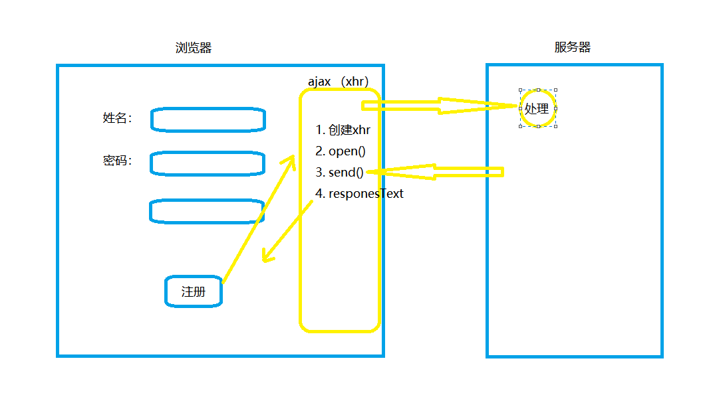

## ajax

##### ajax 是一种用于创建快速动态网页的技术

- 通过在后台与服务器进行少量数据交换，ajax 可以使网页实现异步更新。这意味着可以在不重新加载整个网页的情况下，对网页的某部分进行更新

- 在传统的网页（不使用ajax）如果需要更新内容，必须重新加载整个网页

##### 前面谈到ajax是什么，其主要也就是异步提交，大家是否知道同步和异步提交的区别？

- 同步提交：当用户发送请求时，当前页面不可以使用，服务器响应页面到客户端，响应完成，用户才可以使用页面。

- 异步提交：当用户发送请求时，当前页面还可以继续使用，当异步请求的数据响应给页面，页面把数据显示到对应的区域。

### ajax 工作原理

- 客户端发送请求，请求交给 xhr，xhr把请求提交给服务，服务器进行业务处理，处理完后服务器响应数据交给 xhr 对象，xhr对象接收数据，由 JavaScript 把数据写到页面上，如图：

    

### ajax请求的步骤

- 创建 XMLHttpRequest 对象（创建一个异步调用对象）
- 创建一个新的 Http 请求，（并指定该 http 请求的方法、URL及验证信息）
- 使用 open 方法与服务器建立连接 （配置响应 HTTP请求状态变化的函数）
- 向服务器发送数据（发送HTTP请求）
- 在回调函数中针对不同的响应状态进行不同处理（获取异步调用返回的数据）

```js
    function ajaxDemo() {
        // 1. 创建xhr对象
        var xhr = new XMLHttpRequest();
        // 2. 通过xhr对象 指定当前对象的 请求方式，URL路径
        xhr.open("GET", "url", true)
        // 3. 发送请求
        xhr.send();
        // 4. 获取异步调用返回的数据
        xhr.onreadystatechange = function() {
            // readyState=4, 表示 XMLHttpRequest 对象读取服务器的响应结束
            // status=200，表示响应成功
            if (xhr.readyState == 4 && xhr.status == 200) {
                console.log(xhr.responseText);
            }
        }
    }
```

### 需掌握的几个功能点

#### 1、创建原生 ajax 对象

- XMLHttpRequest 是Ajax的基础，所以现代浏览器（IE7+、Firefox、Chrome、Safari 以及 Opera）均内建 XMLHttpRequest 对象。

    ```js
        const xhr = new XMLHttpRequest();
    ```

- 老版本的IE5、IE6的JavaScript对象都是使用 ActiveX 来实现的标准，所以没有 XMLHttpRequest对象。他们创建一个对象使用这种方式：(了解即可)

    ```js
        const instance = new ActiveXObject("Microsoft.XMLHTTP");
    ```

#### 2、Ajax 发送请求

- 首先来看一下XMLHttpRequest如何发送一个请求到服务器

    ```js
        const xhr = new XMLHttpRequest();
        xhr.open(method, url, async);
        xhr.send();
    ```

> 这里用到两个方法：第一个open方法其实是配置ajax必要的信息，第二个send才是真正的发起请求到服务器。

#### 3、ajax 通过 readyState 状态的变化接收服务器响应

当请求被发送到服务器时，我们需要执行一些基于响应的任务，每当 readyState 改变时，就会触发 onreadystatechange 事件，readyState 属于存有 XMLHttpRequest 的状态信息。

#### 4、跨域请求的处理

- 当我们请求其他服务器的资源时，浏览器安全限制会阻止该请求。这也是遵循了同源策略。
- 怎么解决跨域，核心都是需要服务器配合处理跨域
    - 采用jsonp方法，这个方法也是要后台配合处理，由后台进行请求，然后将数据拼装在一个json对象返回到前台，然后前台通过callback函数来进行操作，比较繁琐（只支持get请求）
    - 采用 cors 
    - 反向代理服务器，通过代理服务器请求外围，然后转发到我们服务器上，在自己发送到前台